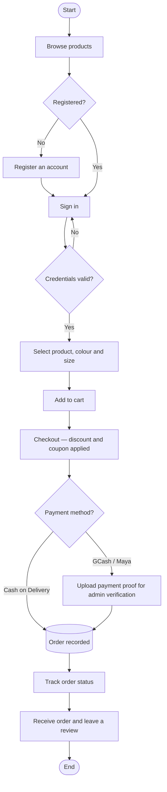
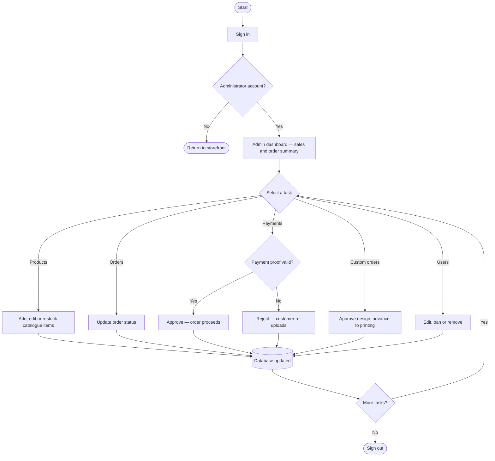
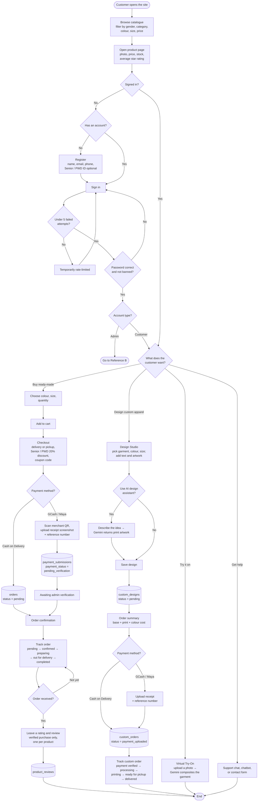
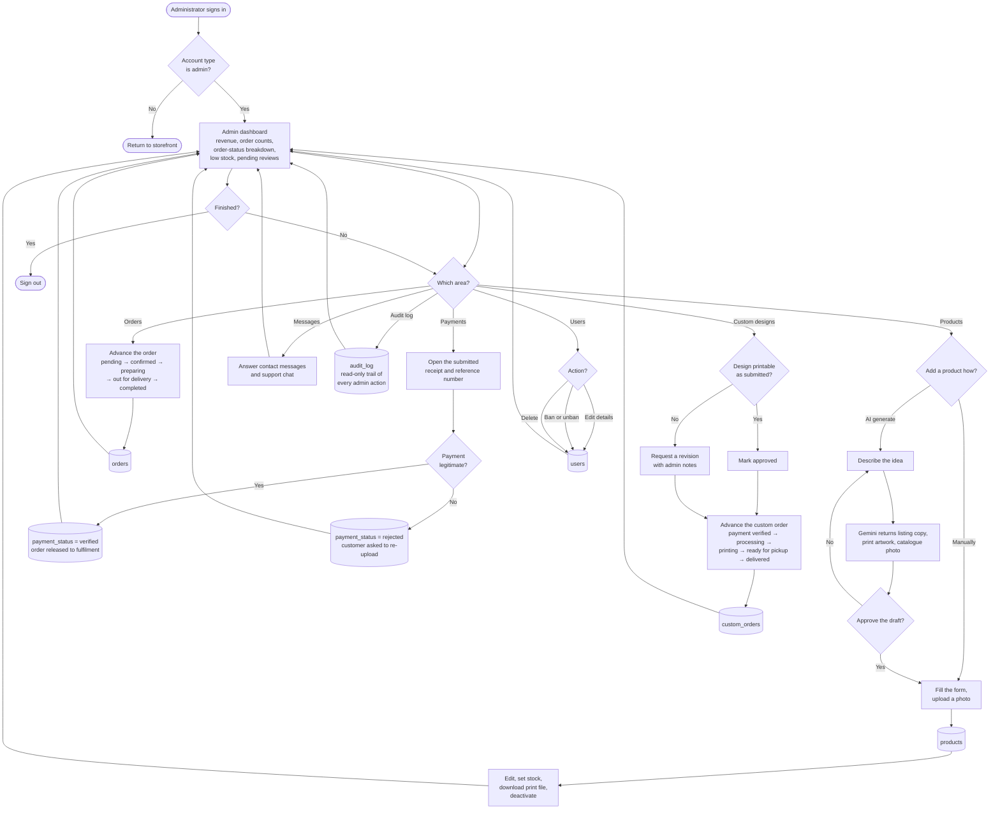

# System Flowchart — User and Admin Side

**Thread & Press Hub** · System's Structure

Two traced paths through the live system: what a customer moves through from first visit to
leaving a review, and what an administrator moves through from sign-in to fulfilment.

Every decision below corresponds to a branch that exists in the source, not to an idealised
design. Where the build does not do something, it is not drawn.

- **Figures 1 and 2** are sized for the paper — few enough steps to stay readable when printed.
- **References A and B** carry every branch in the build, for questions the simplified figures invite.

> The Mermaid diagrams render automatically on GitHub. To export one as an image, paste its code
> block into <https://mermaid.live>. Pre-rendered PNGs of Figures 1 and 2 are also available.

---

## Symbols

Standard flowchart notation. The same four shapes carry the same meaning in every figure.

| Shape | Name | Meaning |
| --- | --- | --- |
| Rounded rectangle | Terminal | Where a path starts or ends |
| Rectangle | Process | An action the system or the person performs |
| Diamond | Decision | A branch, labelled on every outgoing arrow |
| Cylinder | Data store | A database table the step writes to |

---

## Figure 1 — User Side

From landing page to review. Both payment methods produce an order; only the online route waits
on an administrator first.



---

## Figure 2 — Admin Side

One sign-in, one dashboard, five areas of work. Every task returns to the dashboard, so the shape
is a loop rather than a line.



---

## Reference A — Full user path

Not for the paper. Keep this on hand during the defence: if a panellist asks where custom apparel,
virtual try-on or the support channels sit, they are here.

The rate-limit and banned-account checks sit *inside* sign-in rather than before it, which is why a
wrong password and a locked account leave by the same arrow.



---

## Reference B — Full admin path

Payment verification is the only place a customer-facing order state changes without the customer
acting, and rejection loops the customer back to re-upload rather than cancelling the order. The AI
product generator writes nothing until the draft is approved.



---

## Where each decision lives

If the panel asks whether the flowchart matches the build, this is the answer: every diamond maps
to a specific branch in a specific file.

| Decision | File | What it checks |
| --- | --- | --- |
| Credentials valid? | `login.php` | `password_verify()`, the `users.status` column, and a 5-attempt limit from `login_attempts` |
| Administrator account? | `login.php` | `user_type === 'admin'` routes to the admin dashboard |
| Payment method? | `checkout.php` | Cash on Delivery confirms immediately; other methods redirect to the QR page |
| Payment proof valid? | `admin/payment-verification.php` | Approve sets `verified`; reject sets `rejected` |
| Order received? | `orders.php` | The review form unlocks once the order reaches the customer |
| Verified purchase? | `includes/reviews.php` | Requires a non-cancelled order containing that product |
| Approve the draft? | `admin/ai-product-ajax.php` | Generation is a draft; nothing is inserted until Save |
| Design printable? | `admin/custom-designs.php` | Sets `approved` or `revision` with admin notes |

---

## Status pipelines

The two fulfilment pipelines referenced above, taken from the column definitions.

**`orders.status`**

```
pending → confirmed → preparing → out_for_delivery → completed
                                                   ↘ cancelled
```

**`orders.payment_status`**

```
unpaid → pending_verification → verified
                              ↘ rejected → (customer re-uploads)
```

**`custom_orders.status`**

```
pending_payment → payment_uploaded → payment_verified → processing
    → printing → ready_pickup → delivered
                              ↘ cancelled
```

---

## Scope note

The `mfa_otps` and `gcash_transactions` tables exist in the schema, but no code path currently
reaches them, so they are not drawn.

Showing a step the build does not perform is the one thing that turns a flowchart into a liability
during a defence.
